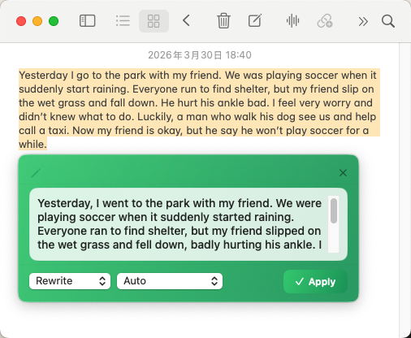
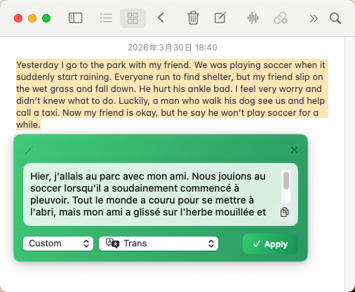
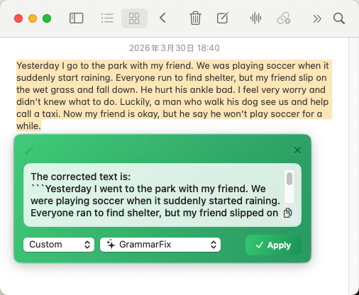
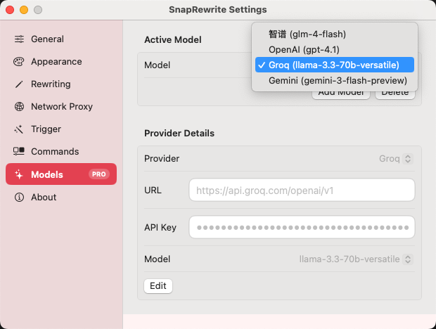
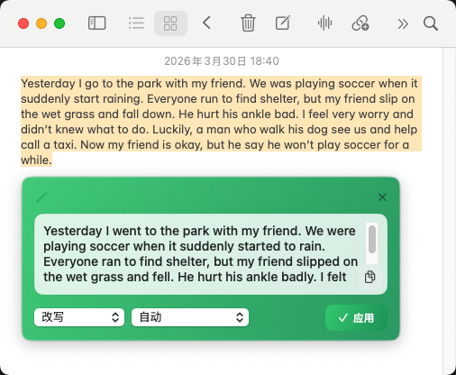
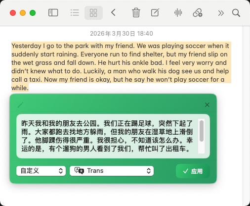
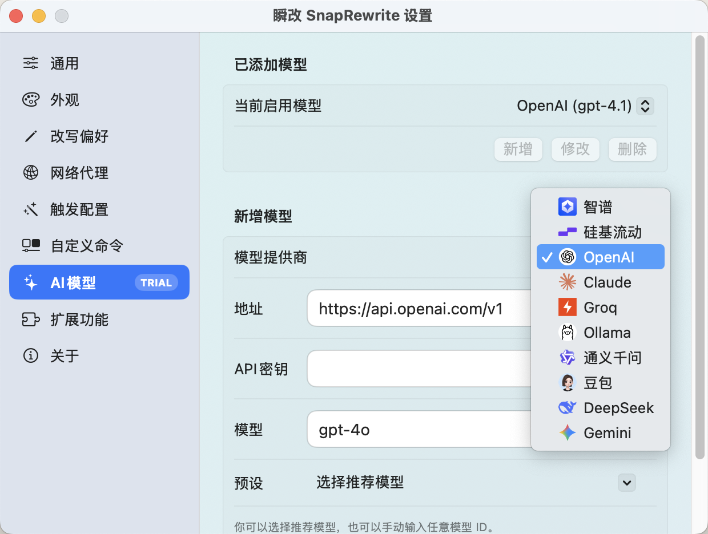

# SnapRewrite

English | [简体中文](#简体中文)

SnapRewrite is a macOS menu bar AI writing assistant for fast, in-context text improvement across apps.
Select text, trigger, generate, and apply without tab switching or copy-paste loops.

## What It Does

- Rewrites and polishes text instantly in your current app
- Translates between Chinese and English
- Fixes grammar and tone
- Supports custom command workflows
- Connects to multiple model providers (including OpenAI-compatible endpoints)

## Core Workflow

1. Select text in any editable field
2. Trigger with drag selection, double-click selection, or hotkey
3. Generate with a style or custom command
4. Apply result back in place

## Highlights

- Low-friction workflow for email, docs, chat, and notes
- Privacy-first behavior: requests are sent only when you trigger actions
- Customizable UI style and trigger behavior
- Free trial flow available from GitHub Releases

## Download

- Releases: https://github.com/yuanpli/snaprewrite/releases
- Installation Guide (EN): `./install-en.html`
- Installation Guide (ZH): `./install-zh.html`

## Product Preview

---

## 简体中文

[English](#snaprewrite) | 简体中文

瞬改 SnapRewrite 是一款 macOS 菜单栏 AI 写作助手，帮助你在任意应用内快速完成文本改写与优化。
选中文字后即可触发生成并一键回填，无需切换窗口、无需反复复制粘贴。

## 产品能力

- 在当前应用内即时改写和润色文本
- 中英双向翻译
- 语法修复与语气调整
- 支持自定义命令工作流
- 支持多模型接入（含 OpenAI-compatible 接口）

## 使用流程

1. 在任意可编辑文本区域选中文本
2. 通过拖选、双击或快捷键触发
3. 选择写作风格或自定义命令生成结果
4. 一键替换回原文位置

## 亮点

- 面向邮件、文档、聊天、笔记等真实写作场景
- 隐私优先：仅在你主动触发时才发送请求
- 支持触发方式和界面样式自定义
- 体验版可通过 GitHub Releases 获取

## 下载

- Releases: https://github.com/yuanpli/snaprewrite/releases
- 安装说明（中文）：`./install-zh.html`
- Installation Guide (EN): `./install-en.html`

## 产品预览

